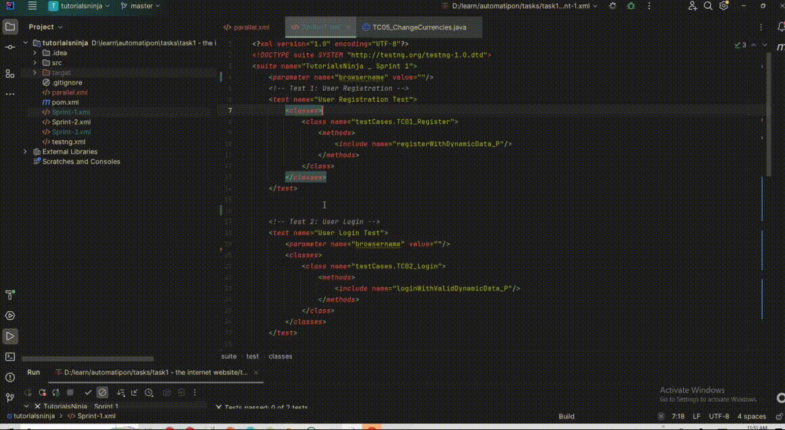
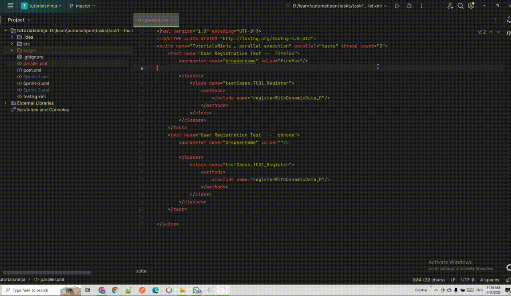

# Tutorial Ninja


## Table of Contents

- [Introduction](#introduction)
- [Examples](#examples)
- [Features](#features)
- [Installation](#installation)
- [Usage](#usage)
- [Contributing](#contributing)
- [License](#license)

---

## Introduction

**Tutorial Ninja** is an eCommerce application that offers various features and services for online shopping. This repository contains the source code for the Tutorial Ninja platform.

---

## Examples

### Local Testing Execution Example



### Parallel Testing Execution Example



---

## Features

- User account creation and management.
- eCommerce purchasing features (e.g., laptops, mobiles).
- Easy-to-use interface for seamless shopping.

---

## Installation

To set up the **Tutorial Ninja** application locally, follow these steps:

1. **Clone the repository**
   ```bash
   git clone https://github.com/moaazawwad/TutorialsNinja.git
